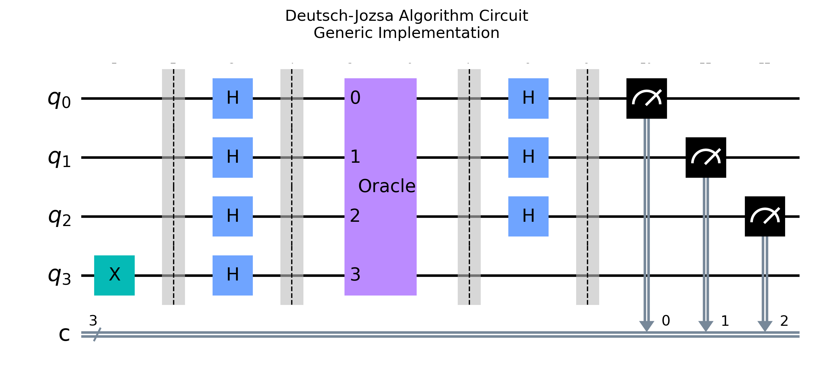
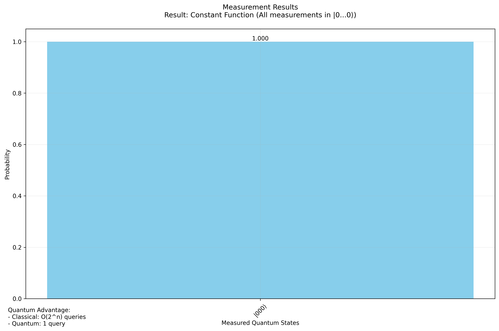
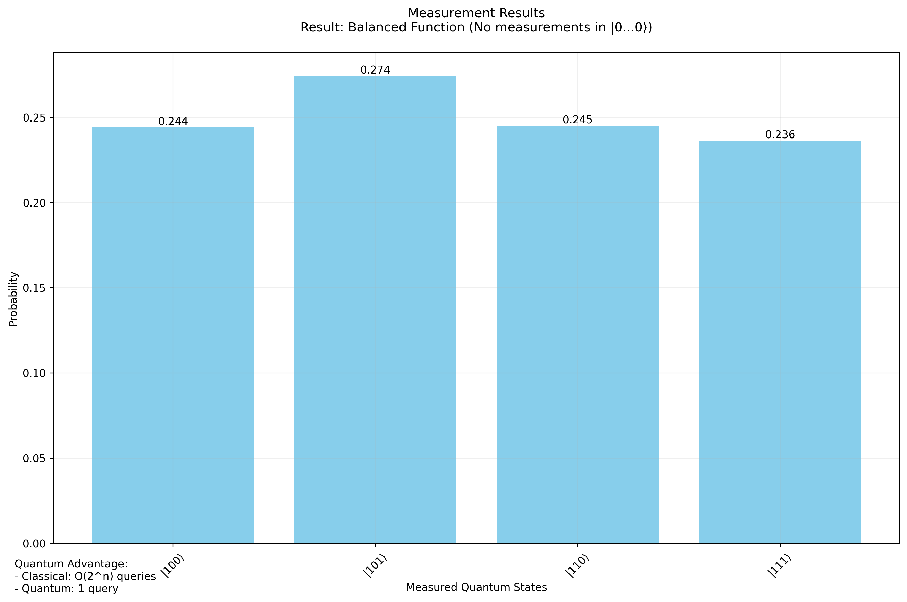

# Deutsch-Jozsa Algorithm Project

This repository demonstrates the implementation of the Deutsch-Jozsa algorithm, a foundational quantum algorithm that determines if a given function is constant or balanced using a single query. The project includes visualization of the circuit and results, and an analysis of quantum advantages.

## Overview
The Deutsch-Jozsa algorithm highlights quantum computing's capability for exponential speedup. It answers the question of whether a black-box function is constant or balanced using quantum parallelism and interference.

### Key Features
- Implementation of the Deutsch-Jozsa algorithm for \( n \)-qubit functions.
- Oracle generation for both constant and balanced functions.
- Visualization of quantum circuits and measurement histograms.
- Comprehensive unit tests to verify correctness.

## Installation

### Clone the Repository
```bash
git clone https://github.com/shidsa6/Deutsch-Jozsa-Algorithm.git
cd Deutsch-Jozsa-Algorithm
```

### Set Up the Environment
```bash
python -m venv qiskit_env
source qiskit_env/bin/activate
pip install -r requirements.txt
```

## Directory Structure
```
Deutsch-Jozsa-Algorithm/
├── src/
│   ├── main.py         # Main execution of the algorithm
│   ├── oracle.py       # Oracle implementation
│   └── visualize.py    # Visualization utilities
├── tests/              # Unit tests
├── docs/              
│   ├── discussion.md   # Technical explanation and results
│   ├── dj_circuit_generic.png # Circuit diagram
│   ├── dj_probabilities_constant.png # Constant function results
│   └── dj_probabilities_balanced.png # Balanced function results
└── requirements.txt     # Python dependencies
```

## Usage

### Run the Algorithm
```bash
python -m src.main
```

### Visualize Results
```bash
python -m src.visualize
```

### Run Unit Tests
```bash
python -m unittest discover tests
```

## Examples & Results

### Generic Quantum Circuit


The circuit implements:
- Qubit initialization
- Initial Hadamard transforms
- Oracle function (black box)
- Final Hadamard gates
- Measurement

### Constant Function Case


#### Output
|000⟩: 100% probability  
Circuit Depth: 5  
Number of Qubits: 4  
Oracle: f(x) = 0 for all x

### Balanced Function Case


#### Output
|001⟩: 25% |100⟩: 25% |011⟩: 25% |110⟩: 25%  
Circuit Depth: 14  
Number of Qubits: 4  
Oracle: Equal 0s and 1s

## Quantum Advantage
- **Classical Solution**: Requires O(2^n) queries to distinguish constant and balanced functions.
- **Quantum Solution**: Requires O(1) query, showcasing exponential speedup.

## Notes
Ensure Python dependencies are correctly installed and check for compatibility with the latest Qiskit version.
